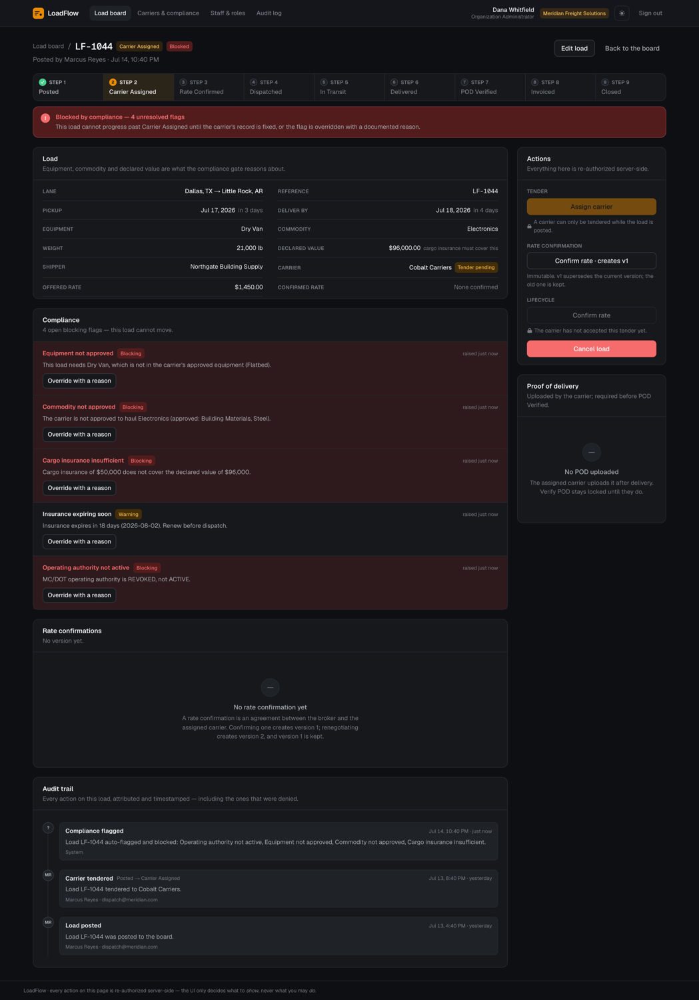
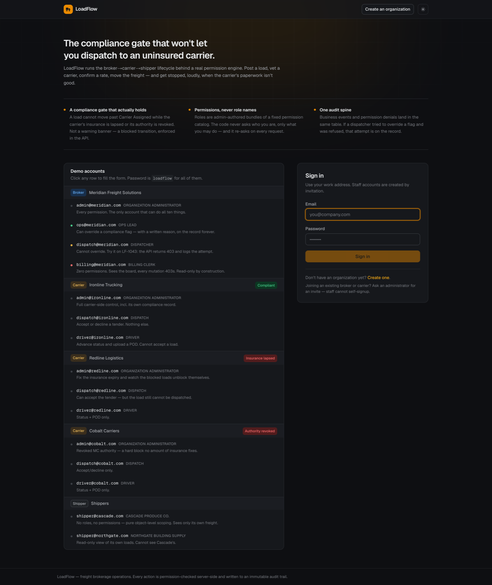
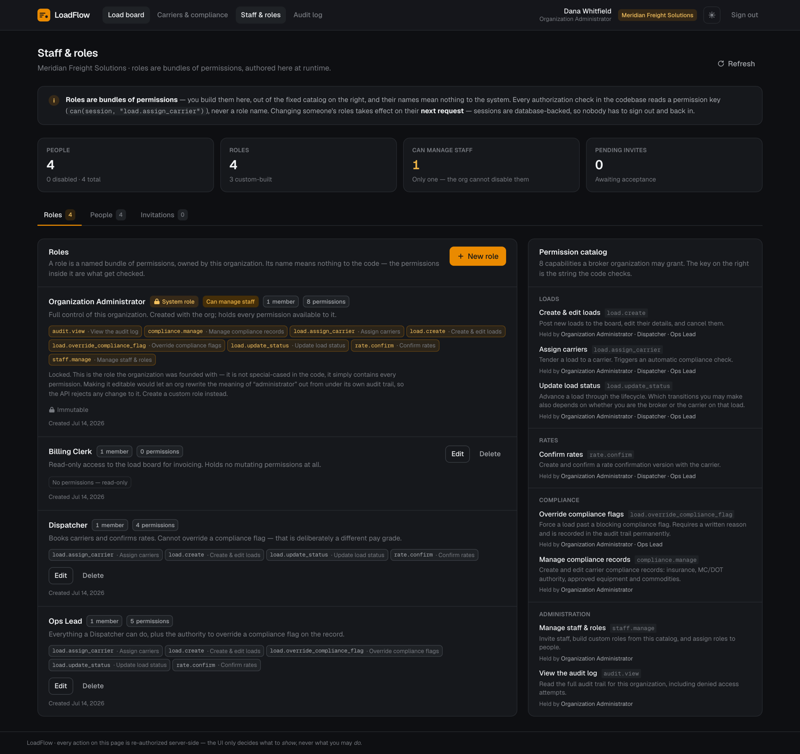
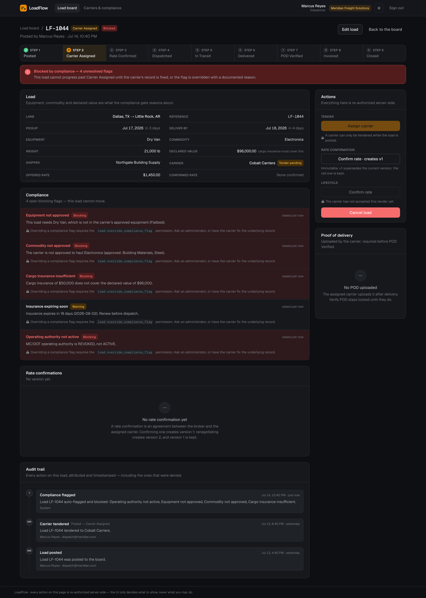
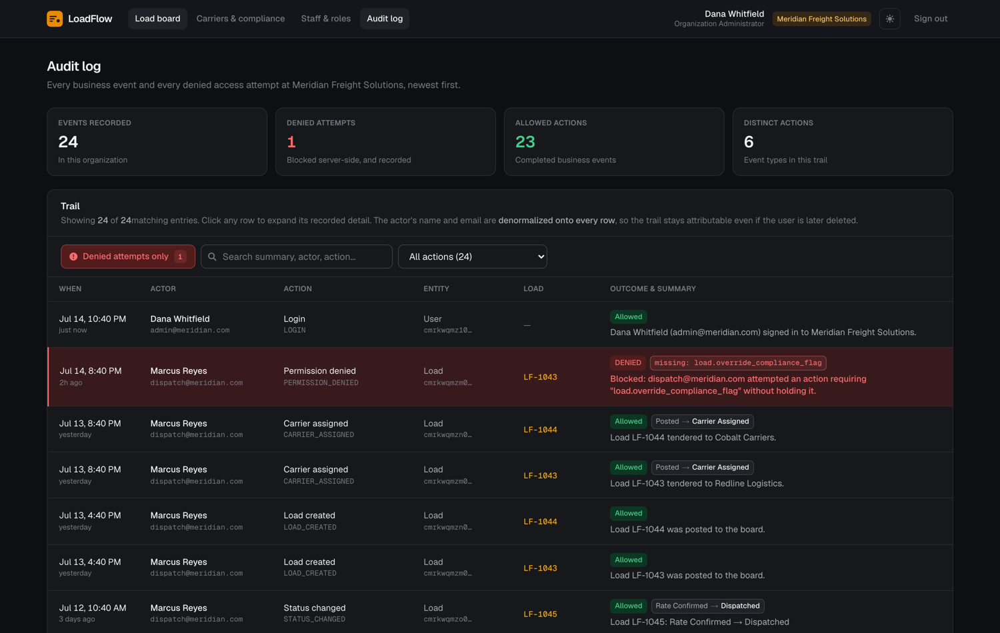
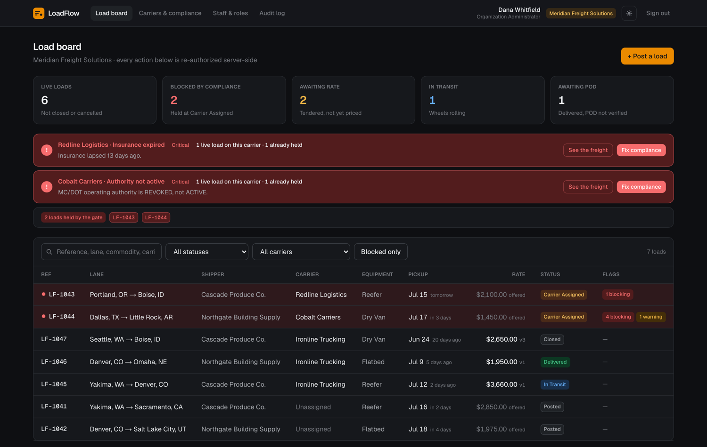
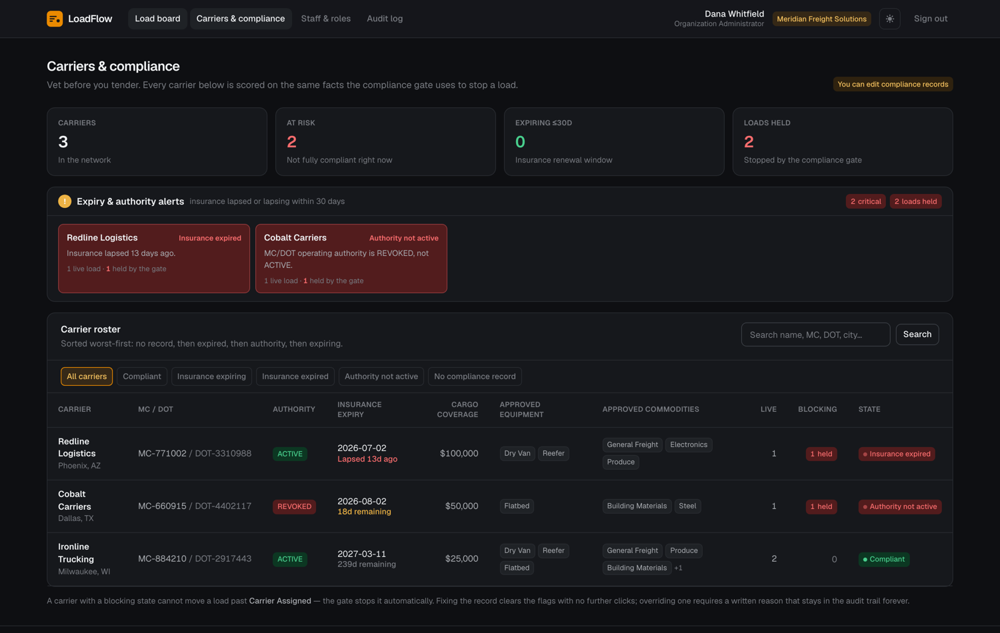
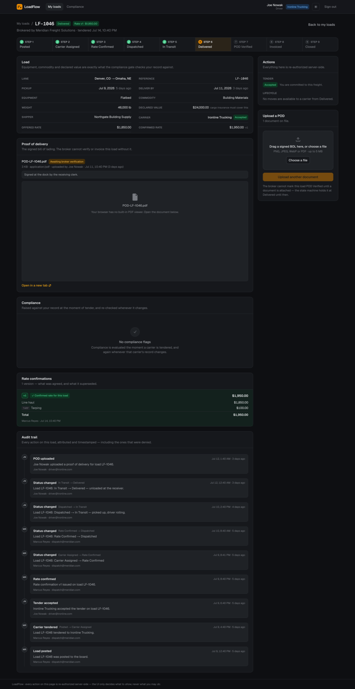
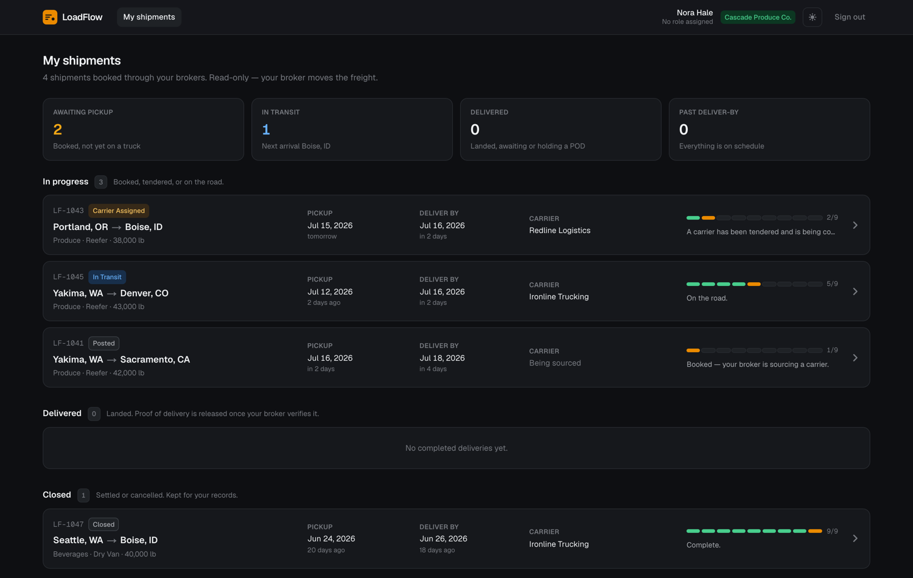
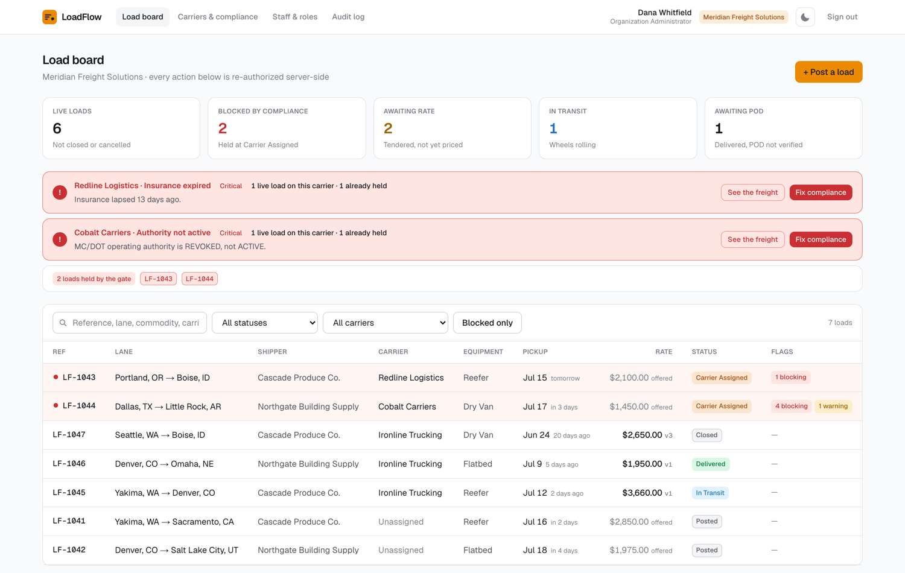

# LoadFlow

**A freight brokerage operations suite — with a compliance gate that will not let you dispatch to an uninsured carrier.**

A freight broker sits between shippers (who have goods to move) and carriers (trucking companies that move them). The broker posts loads, tenders them to carriers, negotiates rates, and tracks each shipment from pickup to delivery. It is a business built on liability: **a broker is legally on the hook if it dispatches freight to a carrier whose insurance has lapsed or whose operating authority has been revoked.**

LoadFlow makes that mistake impossible to make by accident. The moment a carrier is assigned to a load, its compliance record is evaluated, and a load with an open blocking flag **cannot move past `Carrier Assigned`** — not from the UI, not from `curl`, and not even for an administrator who holds every permission in the system. Everything else in the app exists to make that guarantee credible.



> *A Dispatcher looking at a blocked load. Four rules fired automatically the instant the carrier was tendered. Every override control is locked — and names the exact permission it would take. The API returns the same 409 to `curl`.*

---

## Live demo

### 🔗 https://loadflow-garvbahl37-gifs-projects.vercel.app

Every password is **`loadflow`**, and the login page lists every demo persona with one click to fill the form. Deployed on **Vercel + Supabase Postgres**; the same codebase runs locally on SQLite with zero configuration (below).

---

## Table of contents

1. [Run it locally](#run-it-locally)
2. [The demo world](#the-demo-world)
3. [The core workflow, end to end](#the-core-workflow-end-to-end)
4. [How the RBAC system works](#how-the-rbac-system-works)
5. [The screens](#the-screens)
6. [Architecture & data model](#architecture--data-model)
7. [Verifying it works](#verifying-it-works)
8. [Stack & technical choices](#stack--technical-choices)
9. [Assumptions, gaps, and what I'd do next](#assumptions-gaps-and-what-id-do-next)
10. [Documentation index](#documentation-index)

---

## Run it locally

Requires **Node 20+**. No database server, no Docker, no API keys, no `.env` to write.

```bash
git clone https://github.com/garvbahl37-gif/LoadFlow.git
cd LoadFlow
npm install
npm run setup     # migrate SQLite + generate client + seed a full demo world
npm run dev       # http://localhost:3000
```

Open http://localhost:3000, and sign in from the one-click demo panel. That's the whole setup — a reviewer can be inside the app in about a minute.

```bash
npm test             # 29 unit tests — permission engine, state machine, compliance rules
npm run rbac:proof   # 24 assertions attacking the REST API directly over HTTP (server must be running)
npm run db:reset     # wipe and re-seed the demo world
```



> *The login page. Every persona is one click to fill the form, grouped by organization, each with a one-line note on what makes it interesting — so a reviewer never has to hunt for credentials.*

---

## The demo world

The seed builds a small but *complete* freight world — including the failure cases, because a demo that only shows the happy path proves nothing.

**Broker — Meridian Freight Solutions**

| Account | Role | What makes it interesting |
|---|---|---|
| `admin@meridian.com` | Organization Administrator | Holds every broker permission. |
| `ops@meridian.com` | Ops Lead | Dispatcher's permissions **plus** the authority to override a compliance flag. |
| `dispatch@meridian.com` | Dispatcher | **Cannot** override a flag. Try it — the API returns 403 and logs the attempt. |
| `billing@meridian.com` | Billing Clerk | **Zero** permissions. Can read the board; every mutation returns 403. |

**Carriers** (each has `admin@`, `dispatch@` = accept/decline only, `driver@` = status + POD only)

| Organization | State | Effect |
|---|---|---|
| Ironline Trucking | Fully compliant | The happy path. |
| Redline Logistics | **Insurance lapsed** | Holding load LF-1043. Renew the insurance and watch the load unblock itself. |
| Cobalt Carriers | **Authority revoked** | Holding LF-1044, with four separate blocking flags. |

**Shippers** — `shipper@cascade.com`, `shipper@northgate.com` (no roles at all; they see only their own freight, read-only)

Loads **LF-1043** and **LF-1044** are blocked by the compliance gate out of the box.

---

## The core workflow, end to end

A load moves through a **ten-state lifecycle**, and every transition is governed by a declarative state machine: it knows *which permission* the transition needs, *which side of the deal* (broker or carrier) may perform it, and *what guards* must hold. Nothing in the codebase can change a load's status except through this machine.

```
POSTED ──▶ CARRIER_ASSIGNED ──▶ RATE_CONFIRMED ──▶ DISPATCHED ──▶ IN_TRANSIT
  │              │  ▲                                                  │
  │       [COMPLIANCE GATE]                                            ▼
  │              │                                                DELIVERED
  ▼         (carrier declines)                                        │
CANCELLED   returns to board                          [POD required]  ▼
                                    CLOSED ◀── INVOICED ◀──────── POD_VERIFIED
```

Who does what, and what it takes:

| Step | Actor | Permission | Guard |
|---|---|---|---|
| Post a load | Broker | `load.create` | — |
| Assign a carrier | Broker | `load.assign_carrier` | compliance is evaluated on entry |
| Accept / decline the tender | Carrier | `load.accept_decline` | — |
| Confirm a rate | Broker | `rate.confirm` | **no open blocking flags**; carrier accepted |
| Dispatch | Broker | `load.update_status` | **no open blocking flags** |
| Mark in transit → delivered | Carrier | `load.update_status` | — |
| Upload proof of delivery | Carrier | `pod.upload` | load has shipped |
| Verify the POD | Broker | `load.update_status` | **a POD has been uploaded** |
| Invoice → close | Broker | `load.update_status` | — |

This entire lifecycle is exercised end-to-end by an automated test that creates a fresh load and drives it through every state as the correct persona ([verifying it works](#verifying-it-works)).

### The compliance gate is the heart of it

When a broker tenders a load, seven rules run against the carrier's compliance record: insurance expiry, MC/DOT authority status, approved equipment, approved commodities, cargo-coverage sufficiency, and whether a record exists at all. Any blocking finding **stops the load at `Carrier Assigned`**. There are exactly two ways forward:

1. **Fix the cause.** Renew the carrier's insurance (or reactivate authority), and the evaluator re-runs across every live load for that carrier and clears the flag automatically — no further clicks. This is the single most satisfying moment in the product: *"Insurance renewed — 1 load unblocked."*
2. **Override it, on the record.** A user with `load.override_compliance_flag` can force past a flag, but only with a written reason, which is stamped into the audit trail permanently. An override is scoped to *that specific carrier* — re-tender the load to a different carrier who breaks the same rule and the flag re-raises.

---

## How the RBAC system works

This is built as a **real permission system, not three hardcoded roles.** The distinction matters, and the code enforces it.



> *The RBAC console. Roles are authored here, at runtime, from a fixed catalog of 10 permissions. The catalog on the right shows the **key the code actually checks** (`load.assign_carrier`) next to each capability. "Dispatcher" and "Ops Lead" differ by exactly one permission — `load.override_compliance_flag` — and that single difference is the whole compliance-override demo.*

* **Roles are admin-authored bundles of permissions**, built through the UI from a fixed catalog. Their *names are meaningless to the code* — every authorization decision is `can(session, "load.assign_carrier")`, never `if (role.name === "...")`. A test (`tests/no-role-names.test.ts`) greps the entire source tree and **fails the build** if any conditional branches on a role name.

* **Three independent layers of access control**, all enforced server-side in [`src/lib/authz/guard.ts`](src/lib/authz/guard.ts):
  1. **Authentication** — a database-backed session (not a JWT), so revoking a user or editing a role takes effect on their *next request*, not whenever a token happens to expire.
  2. **Permission** — the union of the user's roles, plus an **org-type lock**: a carrier can never hold `load.create` even if a row were forged, because that permission does not apply to carriers.
  3. **Scope** — org-level and object-level, `AND`ed into every query. A broker sees only loads it brokered; a carrier only loads tendered to it; a shipper only its own freight. A permission can widen what you may *do*; it can never widen what you may *see*. Out-of-scope reads return **404, not 403** — we never confirm the existence of a record you may not see.

* **API-layer enforcement is mandatory.** Hiding a button is a courtesy, never a control. Every mutation is re-checked server-side, and [docs/RBAC-PROOF.md](docs/RBAC-PROOF.md) contains copy-paste `curl` commands proving a lower-privileged account is blocked when it hits a restricted endpoint directly.



> *The same blocked load, seen by a Dispatcher. Every override control is disabled and names the exact permission it needs — the app shows you the locked door rather than hiding it. A Dispatcher who `curl`s the override endpoint directly gets a 403, and the attempt is recorded in the audit log.*

* **Every permission-denied attempt is logged** — not to a console, but as a queryable audit row.



> *The audit log. Business events and permission denials land in the same table, so "who did what" and "who *tried* what" sit side by side. The red rows are the denied attempts, each showing the missing permission key in monospace. There is a live "denied attempts only" filter.*

---

## The screens

Each of the three account types gets a purpose-built dashboard.

**Broker — the load board.** A dense, filterable board with a stat row, an alerts strip for carriers whose paperwork has lapsed, and search/filter across reference, lane, commodity, and carrier. Blocked loads are instantly identifiable.



**Broker — carrier vetting.** A risk dashboard: every carrier's authority, insurance expiry with days remaining, cargo coverage, and how many of this broker's loads each carrier is currently blocking — worst first.



**Carrier — assigned loads, status actions, and POD.** A carrier sees only its own freight. The persona split is real: a `driver@` can update status and upload a POD but cannot accept a tender; a `dispatch@` is the exact reverse.



**Shipper — read-only shipment tracking.** No roles, no permissions — pure object-level scoping. A shipper sees status, lane, dates, carrier, and delivery confirmation, and **nothing** of the broker's internal machinery: no rates, no compliance flags, no staff names. Getting that boundary right is a counterparty firewall, and it's enforced at the API, not just the UI.



**Light mode**, because it's a real product.



The app is dark by default, theme-toggleable, and responsive — navigation shows an instant skeleton the moment you click, so it always feels immediate even while the server renders.

---

## Architecture & data model

```
Org (BROKER | CARRIER | SHIPPER)
 ├─ User ──< UserRole >── Role ──< RolePermission >── Permission (fixed catalog)
 ├─ Invite            (staff join by invitation; they cannot self-signup)
 └─ CarrierCompliance (insurance, MC/DOT authority, approved equipment/commodities)

Load  (POSTED → CARRIER_ASSIGNED → RATE_CONFIRMED → DISPATCHED → IN_TRANSIT
       → DELIVERED → POD_VERIFIED → INVOICED → CLOSED, + CANCELLED)
 ├─ shipperOrg / brokerOrg / carrierOrg   (the three parties to a load)
 ├─< RateConfirmation   (versioned & immutable; the load remembers the one confirmed)
 ├─< ComplianceFlag     (OPEN blocking flags stop the load at CARRIER_ASSIGNED)
 ├─< ProofOfDelivery    (bytes stored in the DB; verified by the broker)
 └─< AuditLog           (the load's attributed, timestamped timeline)
```

Load-bearing design decisions:

* **The state machine is data, not code paths.** [`src/lib/loads/state-machine.ts`](src/lib/loads/state-machine.ts) is a table of `(from, to, permission, actor, guards)`. Every status change funnels through one function, so the machine and the compliance gate cannot be bypassed.
* **Rate confirmations are versioned and immutable.** v2 supersedes v1; v1 is never edited or deleted. `Load.confirmedRateConfirmationId` remembers the version actually agreed and freezes at dispatch — so a load closed months ago still shows the rate it closed on.
* **One audit spine** carries business events *and* denied attempts, so the "log permission-denied attempts" requirement is a queryable feature, not console noise. The actor's name and email are denormalized onto each row, so the trail survives the user being deleted.
* **Bootstrap is explicit.** The first admin of an org self-signs-up (creating the org and its founding admin in one transaction). Staff **cannot** self-signup — an admin issues an invite, and the invitee joins with exactly the roles pinned to it.

Full contract in [docs/ARCHITECTURE.md](docs/ARCHITECTURE.md).

---

## Verifying it works

This project is verified, not asserted. Three layers:

| Layer | What it proves | Command |
|---|---|---|
| **29 unit tests** | The permission engine, state machine and compliance rules — including that a forged carrier permission still can't create a load, a shipper holds nothing, a WARNING flag never blocks but a BLOCKING one always does. | `npm test` |
| **24-assertion RBAC proof** | API-layer enforcement, over real HTTP with no UI involved: anonymous callers, permission separation, the gate outranking even an admin, cross-org isolation (404 not 403), the lockout guard, and that every denial was recorded. | `npm run rbac:proof` |
| **Full-lifecycle drive** | A fresh load created and pushed through all ten states as the correct personas — post → assign → accept → rate v1 → confirm → renegotiate v2 → dispatch → in transit → delivered → POD upload → verify → invoice → close — with the audit trail and rate versioning checked at every step. | (in the repo's verification scripts) |

All three pass locally *and* against the deployed Postgres instance. The RBAC claims in this README each have a test or a `curl` command behind them.

---

## Stack & technical choices

**Next.js 16 (App Router) · TypeScript · Prisma 7 · SQLite (local) / Postgres (deployed) · Tailwind v4.**

* **One repo, one `npm run dev`, no external services** — a reviewer runs it in a minute. *(Stack choice + reason, as the brief asks.)*
* **The API lives in Route Handlers under `src/app/api/**`**, which makes the authorization boundary a real, `curl`-able HTTP surface rather than a function call the UI could tiptoe around.
* **SQLite locally** keeps the whole app one portable file — POD documents included, stored as bytes rather than assuming a blob store. **Postgres for deployment**, selected at runtime from the connection string with zero code change (SQLite can't run on a serverless filesystem — see [docs/DEPLOY.md](docs/DEPLOY.md)).
* **Passwords use Node's built-in `scrypt`** rather than bcrypt/argon2 — a native addon that fails to compile is the most common way a reviewer's `npm install` dies.
* **No API keys of any kind.** Sessions are database rows (no JWT secret); POD documents live in the DB (no storage credential). The app reads exactly one environment variable, and it has a sensible default.

---

## Assumptions, gaps, and what I'd do next

**Assumptions I made**

* A **shipper is an Org** with a single user and no roles, so a `Load` points uniformly at three orgs (shipper / broker / carrier) rather than special-casing one party.
* The **admin role is not special-cased** — "Organization Administrator" is just the auto-created role that happens to hold every permission for that org type. No authorization check anywhere asks whether you are an admin.
* I added **three permissions** beyond the brief's seven (`load.accept_decline`, `compliance.manage`, `audit.view`) because the brief's own examples require them; the original seven are present verbatim.
* **Invites are links, not emails** (no mail server); an admin gets a copy-able `/invite/<token>` URL.
* The **shipper is not told *why* a load is stalled** — leaking "your broker's carrier has lapsed insurance" across the counterparty boundary felt wrong.

**What's incomplete, honestly**

* **The carrier doesn't counter-sign the rate.** The broker issues a versioned rate confirmation and the carrier accepts the *tender*; a real rate con is signed by both. The versioning model already supports it.
* **No CSRF token.** Mutations are JSON-only (immune to cross-site form posts) with a `SameSite=Lax` cookie; the one multipart endpoint (POD upload) has an explicit `Sec-Fetch-Site`/`Origin` check. A production build should still add a double-submit token.
* **No login rate-limiting** (failed logins are audited, but not throttled) and **no pagination on the load board** (the audit log does paginate).
* **POD bytes live in the database.** Fine for a portable demo; at real scale they belong in object storage with the DB holding a reference.
* **Tests cover the logic and the API boundary, not the UI** — 29 unit tests + 24 HTTP assertions + a full-lifecycle drive, but no component or browser tests in CI. I drove the UI manually across every persona instead.

**In priority order, with more time:** carrier-side rate acceptance → CSRF tokens + login throttling → move POD bytes to object storage → move compliance re-evaluation into a job queue → browser tests in CI.

---

## Documentation index

| | |
|---|---|
| **[docs/ARCHITECTURE.md](docs/ARCHITECTURE.md)** | The domain contract — RBAC model, state machine, compliance rules, audit design. |
| **[docs/RBAC-PROOF.md](docs/RBAC-PROOF.md)** | Copy-paste `curl` commands proving API-layer enforcement. |
| **[docs/API.md](docs/API.md)** | The REST contract, endpoint by endpoint. |
| **[docs/DEPLOY.md](docs/DEPLOY.md)** | Deploying on Postgres (verified) or on SQLite with a persistent disk. |
| **[docs/AI-USAGE.md](docs/AI-USAGE.md)** | How this was built with an AI coding tool — prompt style, review habits, the bugs review caught. |
| **[docs/DEMO-SCRIPT.md](docs/DEMO-SCRIPT.md)** | The 4-minute screen-recording walkthrough. |
| **[docs/CONVENTIONS.md](docs/CONVENTIONS.md)** | Framework ground truth — Next 16 / Prisma 7 / Tailwind 4 all break older muscle memory. |

---

*Built with Claude Code. The commit history is granular and per-feature by design; `docs/AI-USAGE.md` explains the prompt-and-review process, including the adversarial self-audit that caught a live compliance bypass and a password-hash leak the test suite had passed.*
